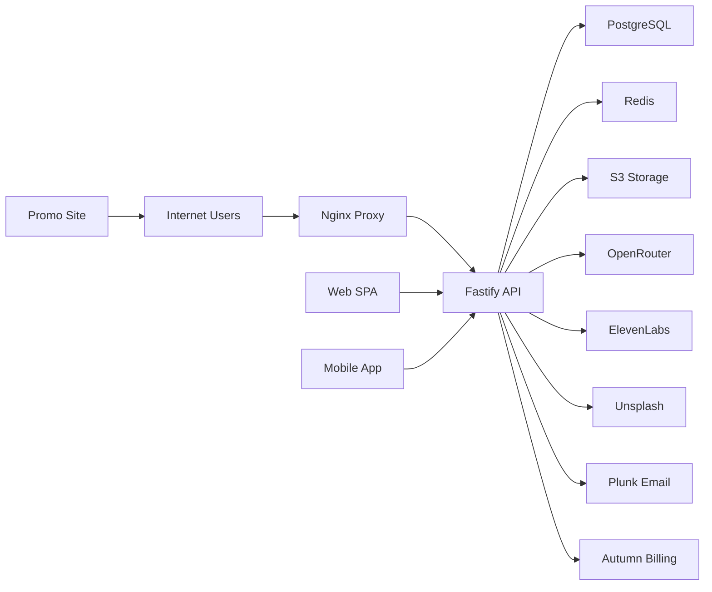

## Executive summary
The highest-risk themes are integrity and abuse in internet-exposed API flows rather than classic pre-auth takeover paths: recommendation/view signal poisoning on public marketplace endpoints, cost-amplifying abuse of AI/media generation routes, and trust-boundary mistakes around proxy/auth/session handling. The most sensitive areas are the Fastify API route layer and sync/media pipelines (`apps/api/routes/*`, `apps/api/lib/sync/*`, `apps/api/routes/flashcards.ts`, `apps/api/routes/tts.ts`) plus browser key/session handling in `apps/frontend/src`.

## Scope and assumptions
- In-scope paths:
- `apps/api` (Fastify runtime routes/plugins/services)
- `apps/frontend` (web SPA runtime/API client behavior)
- `apps/mobile` (mobile runtime/auth/sync behavior)
- `apps/promo` (public marketing site runtime behavior)
- `packages/*` where directly security-relevant to runtime (`packages/api-contracts`, `packages/shared`)
- Out of scope:
- Nginx configuration and host firewall/WAF rules (not present in repo)
- Cloud IAM/network policy definitions (not present in repo)
- Third-party vendor internal security controls (OpenRouter, ElevenLabs, Plunk, Autumn, Unsplash)
- User-validated context:
- Deployment model: public internet API, likely behind Nginx
- Data sensitivity: normal consumer PII
- Scope breadth: full monorepo
- Explicit assumptions:
- Production does not run with `NODE_ENV=test`, so test auth helpers are disabled by route guard (`apps/api/routes/test-auth.ts`).
- API session/cookie security attributes are provided by Better Auth defaults unless overridden (no explicit override in `apps/api/lib/auth/auth.ts`).
- Reverse proxy forwards client IP safely and `TRUST_PROXY` is configured to a constrained value (`apps/api/config/app.ts`, `apps/api/app.ts`).
- Open questions that could materially change ranking:
- Is a WAF/bot mitigation layer active in front of Nginx for public endpoints?
- Are there hard per-user/per-IP quotas at gateway level in addition to app-level limits?

## System model
### Primary components
- Public clients:
- Web SPA (`apps/frontend/src/main.tsx`, API init/client in `apps/frontend/src/lib/api/*`, auth client in `apps/frontend/src/features/auth/auth-client.ts`).
- Expo mobile app (`apps/mobile/App.tsx`, auth + deep links + sync in `apps/mobile/src/services/auth/*`, `apps/mobile/src/app/use-incoming-deep-links.ts`, `apps/mobile/src/services/sync/*`).
- Marketing site:
- Astro promo app, largely static; contact form posts to configurable external action (`apps/promo/src/pages/[...lang]/contact.astro`, `apps/promo/src/config/config.json`).
- API runtime:
- Fastify app with CORS, auth pass-through, plugins, and autoloaded routes (`apps/api/app.ts`, `apps/api/plugins/*`, `apps/api/routes/*`).
- Auth/session layer:
- Better Auth with magic-link, bearer, expo, one-time-token in test mode (`apps/api/lib/auth/auth.ts`, `apps/api/plugins/auth.ts`).
- Data stores:
- PostgreSQL via Drizzle (`apps/api/db/db.ts`, schema in `apps/api/lib/auth/auth-schema.ts`).
- Redis-backed rate limiting when configured (`apps/api/plugins/rate-limit.ts`).
- S3-compatible object storage for uploads and caches (`apps/api/config/s3.ts`, `apps/api/config/upload-router.ts`, `apps/api/services/audio-cache.ts`).
- External integrations:
- OpenRouter, ElevenLabs, Unsplash, Plunk, Autumn, optional Sentry (`apps/api/services/flashcards.ts`, `apps/api/routes/tts.ts`, `apps/api/routes/unsplash.ts`, `apps/api/services/email.ts`, `apps/api/lib/billing/autumn.ts`, `apps/api/plugins/sentry.ts`).
- Transport abstraction:
- tRPC transport endpoint forwarding to `/api/*` via internal Fastify inject with path guard logic (`apps/api/plugins/trpc.ts`, `apps/api/lib/trpc/router.ts`, `packages/api-contracts/src/transport.ts`).

### Data flows and trust boundaries
- Internet -> Nginx (assumed) -> Fastify API (`/api/*`, `/trpc`, `/api/auth/*`):
- Data: auth tokens/cookies, profile data, deck/card content, upload payloads, AI prompts/results.
- Protocol: HTTPS externally; HTTP between proxy and app may vary by deployment.
- Guarantees: CORS origin allowlist with credentials (`apps/api/app.ts`), global/per-route rate limiting (`apps/api/plugins/rate-limit.ts`, route configs).
- Validation: zod schemas on many routes (`fastify-type-provider-zod` across `apps/api/routes/*`), plus route-specific checks.
- Browser/Mobile -> Better Auth endpoints (`/api/auth/*`):
- Data: magic-link and session token flows.
- Protocol: HTTPS.
- Guarantees: Better Auth handler + trusted origins (`apps/api/lib/auth/auth.ts`).
- Validation: Better Auth plugin logic; test-only one-time-token helper route additionally guarded by secret + env check (`apps/api/routes/test-auth.ts`).
- API -> PostgreSQL:
- Data: user/session tables, decks/cards, sync ledger, ratings/reviews, study events.
- Protocol: DB connection string; no in-repo TLS policy.
- Guarantees: app-side ownership checks in repository/service layers (`apps/api/lib/decks/*`, `apps/api/lib/sync/sync-service.ts`).
- Validation: schema-validated request models before DB writes.
- API -> Redis (optional):
- Data: rate-limit counters keyed by request IP.
- Protocol: redis URI.
- Guarantees: fallback behavior `skipOnError: false` to fail closed if limiter errors (`apps/api/plugins/rate-limit.ts`).
- API -> S3-compatible storage:
- Data: uploaded docs/images/audio and generated audio cache.
- Protocol: S3 API.
- Guarantees: MIME/type/size constraints per upload routes (`apps/api/config/upload-router.ts`, `apps/api/routes/upload.ts`, `apps/api/lib/flashcards/text-extraction.ts`).
- Validation: extension + signature checks for flashcard source extraction (`apps/api/lib/flashcards/text-extraction.ts`).
- API -> External vendors:
- Data: prompts/text to OpenRouter and ElevenLabs, email content to Plunk, usage metering to Autumn, image search/track to Unsplash.
- Protocol: HTTPS fetch/SDK.
- Guarantees: API-key based authentication from server config (`apps/api/config/app.ts`, service/route files).
- Validation: request schema constraints + hostname/path checks for Unsplash tracking (`apps/api/routes/unsplash.ts`).
- Mobile local device -> Mobile backend sync:
- Data: queued deck/card mutations and study events, eventually sent to `/api/sync/incremental` and `/api/study/events/batch`.
- Protocol: HTTPS.
- Guarantees: session auth required server-side (`apps/api/routes/sync.ts`, `apps/api/routes/study-events.ts`).
- Validation: payload schema and server-side ownership checks on apply (`apps/api/lib/sync/sync-service.ts`).

#### Diagram

## Assets and security objectives
| Asset | Why it matters | Security objective (C/I/A) |
|---|---|---|
| Auth sessions/tokens (`session`, cookies, bearer) | Account takeover enables data access and abusive API usage | C, I |
| User PII (`user.email`, profile fields) | Consumer privacy and trust impact | C |
| Private deck/card content | User-generated study material, potentially personal/sensitive | C, I |
| Sync ledger/state (`sync_changes`, client queue semantics) | Cross-device consistency and anti-loss guarantees | I, A |
| Marketplace ranking signals (views/downloads/ratings/trending) | Product integrity and discoverability fairness | I |
| API vendor credentials (OpenRouter/ElevenLabs/Plunk/S3/Autumn keys) | Credential theft enables external abuse and cost impact | C |
| Usage/billing signals (Autumn checks/tracks) | Cost control and entitlement enforcement | I, A |
| Object storage media and cached audio | Private user media and generated content availability | C, A |
| Audit/telemetry logs (Fastify, Sentry) | Incident triage and abuse detection | I, A |
| Service availability of AI/upload/sync endpoints | Core user workflows and retention | A |

## Attacker model
### Capabilities
- Remote unauthenticated internet attacker can call public API endpoints at scale.
- Authenticated low-privilege attacker can create accounts and exercise full user-level API capabilities.
- Attacker can automate traffic across distributed IPs to stress per-IP controls.
- Attacker can attempt client-side abuse (malicious deep links, browser script injection preconditions).
- Attacker can submit hostile-but-valid payloads to upload/sync/search/review flows.

### Non-capabilities
- No assumed direct database or object-store administrative access.
- No assumed compromise of server host, CI runner, or vendor control planes.
- No assumed breaking of TLS primitives.
- No assumed privileged insider with production secret access (unless separately in scope).

## Entry points and attack surfaces
| Surface | How reached | Trust boundary | Notes | Evidence (repo path / symbol) |
|---|---|---|---|---|
| Better Auth handler `/api/auth/*` | Web/mobile auth clients | Internet -> API | Session/token issuance and verification boundary | `apps/api/app.ts` (`url: '/api/auth/*'`), `apps/api/lib/auth/auth.ts` |
| tRPC transport `/trpc` | Frontend/mobile API clients | Internet -> API internal route injector | Public procedure forwards to `/api/*` with allowlisted headers | `apps/api/plugins/trpc.ts`, `apps/api/lib/trpc/router.ts` |
| Flashcard generation `/api/flashcards` | Authenticated multipart upload | Client -> API -> OpenRouter/ElevenLabs/S3/Autumn | High-cost, multi-service path | `apps/api/routes/flashcards.ts` |
| TTS generation `/api/tts/elevenlabs` | Authenticated JSON POST | Client -> API -> ElevenLabs/S3/Autumn | Cost and availability-sensitive | `apps/api/routes/tts.ts` |
| Upload APIs `/api/upload`, `/api/upload/image`, `/api/upload/audio`, `/uploads/*` | Browser/mobile uploads and media reads | Client -> API -> S3/local FS | MIME/size/path checks; mixed upload stacks | `apps/api/plugins/upload.ts`, `apps/api/routes/upload.ts`, `apps/api/config/upload-router.ts` |
| Sync endpoints `/api/sync/*` | Authenticated mobile/web sync | Client -> API -> DB | Integrity-critical state merge/apply | `apps/api/routes/sync.ts`, `apps/api/lib/sync/sync-service.ts` |
| Marketplace/search/view endpoints | Public GET/POST and optional session header | Internet -> API -> DB | Ranking signal and discovery integrity | `apps/api/lib/marketplace/marketplace-public-routes.ts`, `apps/api/routes/search.ts` |
| Study event ingest `/api/study/events/batch` | Authenticated batch POST | Mobile/web -> API -> DB | Analytics ingestion, potential volumetric abuse | `apps/api/routes/study-events.ts` |
| Test auth endpoint `/api/test-auth/one-time-token` | Header-authenticated POST | Internet -> API (conditional test env) | Dangerous if test mode exposed | `apps/api/routes/test-auth.ts` |
| Browser local settings storage | Any JS running in origin | Browser runtime boundary | Stores user-supplied OpenRouter/ElevenLabs API keys | `apps/frontend/src/utils/openrouter-settings.ts`, `apps/frontend/src/utils/elevenlabs-settings.ts` |
| Mobile deep-link auth input `flashly://auth?...` | OS-level link handling | OS/app boundary -> auth flow | Token/OTT parsing and verification path | `apps/mobile/src/app/use-incoming-deep-links.ts`, `apps/mobile/src/screens/AuthScreen.tsx` |
| Promo contact form action | Public form submit | Browser -> configured external endpoint | Endpoint target controlled by config | `apps/promo/src/pages/[...lang]/contact.astro`, `apps/promo/src/config/config.json` |

## Top abuse paths
1. Marketplace ranking poisoning
1. Attacker scripts `POST /api/marketplace/:id/view` with many deck IDs and synthetic session IDs.
2. Service records view events and view-count-weighted trending/search signals shift.
3. Impact: manipulated discovery quality, unfair promotion/suppression of decks.

2. AI cost amplification via authenticated abuse
1. Attacker uses a valid account (or many low-cost accounts).
2. Repeatedly calls `/api/flashcards` and `/api/tts/elevenlabs` near rate/usage limits.
3. API fans out to OpenRouter/ElevenLabs and storage/billing calls.
4. Impact: external spend spikes and degraded service for legitimate users.

3. Browser XSS precondition -> secret/session theft
1. Attacker lands script execution in web origin (for example future sanitizer gap or third-party script compromise).
2. Script reads localStorage keys used for OpenRouter/ElevenLabs and session context.
3. Stolen keys/tokens are replayed for unauthorized generation or account actions.
4. Impact: confidentiality loss and billable abuse.

4. Proxy/IP trust misconfiguration -> limiter evasion
1. Deployment sets `TRUST_PROXY` too permissive.
2. Client-controlled forwarding headers influence perceived client IP.
3. IP-based global and route limits become less effective.
4. Impact: easier brute-force/abuse and noisy telemetry.

5. Conditional test-auth takeover path
1. Production-like environment is accidentally run with `NODE_ENV=test` and reachable test route.
2. Attacker obtains/leaks E2E secret header value.
3. Route mints one-time token and authenticates as test user.
4. Impact: direct unauthorized account access in affected environment.

6. Oversized/hostile upload stress on parsing pipeline
1. Authenticated attacker submits many borderline-large files to upload/flashcard routes.
2. Server does MIME checks, buffering, PDF/text extraction, and downstream model requests.
3. Impact: CPU/memory pressure and latency spikes (availability degradation).

7. Sync integrity abuse by compromised client account
1. Attacker with stolen user session submits crafted sync changes with newer timestamps.
2. Server accepts ownership-valid updates and records them in sync ledger.
3. Impact: user data tampering/loss across devices.

8. CSRF against cookie-auth routes (conditional on cookie policy)
1. Victim with active session visits attacker-controlled site.
2. Cross-site request targets state-changing API endpoint that accepts cookie auth.
3. If cookie SameSite/CSRF protections are weak for that route, action executes.
4. Impact: unwanted state changes under victim account.

## Threat model table
| Threat ID | Threat source | Prerequisites | Threat action | Impact | Impacted assets | Existing controls (evidence) | Gaps | Recommended mitigations | Detection ideas | Likelihood | Impact severity | Priority |
|---|---|---|---|---|---|---|---|---|---|---|---|---|
| TM-001 | Remote unauthenticated attacker | Public API access; ability to send many requests | Automate `POST /api/marketplace/:id/view` with synthetic session IDs to bias ranking signals | Discovery/ranking integrity erosion; business logic abuse | Marketplace ranking signals, analytics trust | Global limiter plugin; schema validation and best-effort tracking (`apps/api/plugins/rate-limit.ts`, `apps/api/routes/search.ts`) | View tracking endpoint accepts optional client session id and returns success even on errors; no dedicated anti-fraud controls | Add endpoint-specific stronger rate limits and per-deck/per-actor throttles; bind view events to signed server-issued session token; add anomaly scoring before counting | Alert on unusual view-to-unique-user ratios and bursty deck-specific spikes | High | Medium | high |
| TM-002 | Authenticated abusive user/botnet | Valid account(s) and internet access | Repeatedly trigger `/api/flashcards` and `/api/tts/elevenlabs` to drive vendor usage/cost | Cost spike and service degradation | Vendor quotas/keys, availability, billing integrity | Per-route rate limits and Autumn usage checks/tracking (`apps/api/routes/flashcards.ts`, `apps/api/routes/tts.ts`, `apps/api/lib/billing/autumn.ts`) | No explicit anti-automation controls beyond app-layer limits; distributed abuse can evade IP-local ceilings | Add account reputation/quota tiers, velocity ceilings per account/device, gateway bot controls, and hard fail-open/fail-closed policy review for vendor outages | Track per-account cost/requests, detect rapid multi-account patterns, create budget alarms | Medium | High | high |
| TM-003 | Script-capable attacker in web origin | XSS or malicious third-party script execution in frontend origin | Exfiltrate OpenRouter/ElevenLabs API keys stored in localStorage, then abuse APIs | User key theft and unauthorized model usage | User-supplied API keys, account context | Markdown sanitization and schema checks reduce common injection vectors (`apps/frontend/src/components/ui/markdown.tsx`) | Keys intentionally stored in localStorage (`apps/frontend/src/utils/openrouter-settings.ts`, `apps/frontend/src/utils/elevenlabs-settings.ts`) | Prefer ephemeral in-memory storage for keys, optional encrypted-at-rest via WebCrypto, strict CSP with nonces and dependency hardening, minimize raw HTML rendering surfaces | Browser CSP violation reports; detect unusual key-usage geolocation/device changes | Medium | Medium | medium |
| TM-004 | External attacker in misconfigured env | `NODE_ENV=test` reachable publicly; E2E secret leakage | Call `/api/test-auth/one-time-token` to mint one-time token for fixed test user | Account takeover in affected environment | Auth/session integrity | Route is gated by test env and header secret checks (`apps/api/routes/test-auth.ts`) | High blast radius if test mode exposed; static test user bootstrap path exists | Compile/deploy-time kill switch to exclude test-auth routes from production artifact; network ACL to block endpoint; rotate E2E secret regularly | Alert on any hit to `/api/test-auth/*` outside CI/dev ranges | Low | High | medium |
| TM-005 | Remote attacker exploiting deployment mistakes | Proxy trust misconfigured (`TRUST_PROXY`) | Spoof client IP context and reduce effectiveness of IP-keyed rate limits | Increased abuse capacity and noisy forensic data | Availability, telemetry integrity | Configurable trust proxy and rate limiter keyed by request IP (`apps/api/app.ts`, `apps/api/plugins/rate-limit.ts`, `apps/api/config/app.ts`) | Safety depends on external Nginx/header hygiene; app lacks explicit forwarded-header sanity policy | Restrict `TRUST_PROXY` to known proxy CIDRs, strip untrusted forwarding headers at Nginx, add canary tests for rate-limit identity | Monitor mismatch between edge IP and app-resolved IP; alert on sudden unique-IP inflation | Medium | Medium | medium |
| TM-006 | Authenticated attacker with upload automation | Valid account; ability to send large/complex files repeatedly | Flood upload/flashcard extraction paths to trigger buffer+parse workloads | Resource exhaustion and latency spikes | API availability, worker capacity | Multipart/file size limits and allowed type checks (`apps/api/plugins/multipart.ts`, `apps/api/lib/flashcards/text-extraction.ts`, `apps/api/config/upload-router.ts`) | Multiple upload paths and expensive parse stages still allow costly legal payloads | Add stricter per-user upload budgets, async job queue with backpressure, content scanning/timeouts, and parser circuit breakers | Track parse duration/size histograms and queue depth alerts | Medium | Medium | medium |
| TM-007 | Compromised user session on mobile/web | Stolen session token/cookie for a user | Submit stale/new sync changes with newer timestamps to overwrite user state | Cross-device data tampering/loss for victim account | Deck/card integrity, sync consistency | Ownership checks and timestamp comparisons in sync apply (`apps/api/lib/sync/sync-service.ts`, `apps/api/routes/sync.ts`) | No stronger device binding or per-device attestation; compromised session can still mutate owned data | Add optional device-bound session claims, risky-change confirmation for destructive sync ops, and audit trails exposed to user | Alert on high-rate destructive sync operations and unusual deviceId churn | Medium | Medium | medium |
| TM-008 | Cross-site request attacker (conditional) | Victim logged in via cookie session; permissive cookie/CSRF posture | Trigger state-changing requests from attacker site to API routes using victim cookies | Unauthorized actions under victim identity | Account/session integrity | CORS allowlist with credentials and auth checks (`apps/api/app.ts`, `apps/api/plugins/auth.ts`) | Non-auth routes rely on route auth without explicit CSRF token checks; cookie policy not explicitly set in repo | Validate Better Auth cookie SameSite/CSRF defaults in production, add explicit CSRF middleware for cookie-auth mutations, prefer bearer-only for APIs when feasible | Log origin/referrer anomalies on mutating routes and alert on cross-site spikes | Low | Medium | low |

## Criticality calibration
- `critical` in this repo:
- User-account or cross-user data compromise with broad blast radius, or irreversible integrity compromise with weak containment.
- Examples:
- Pre-auth auth bypass yielding arbitrary user session issuance.
- Cross-user deck/card read access at scale.
- Theft of server-side master secrets (S3/DB/vendor keys) enabling systemic compromise.
- `high` in this repo:
- Material business/security impact without full systemic compromise.
- Examples:
- Marketplace signal poisoning that materially distorts discovery and trust.
- Sustained cost-amplification abuse on AI/TTS endpoints causing meaningful spend/availability impact.
- Production exposure of test auth bootstrap route.
- `medium` in this repo:
- Scoped user-level compromise or abuse requiring notable preconditions.
- Examples:
- XSS-precondition theft of user-stored API keys in browser localStorage.
- Session theft leading to victim-owned sync tampering.
- Upload parser pressure attacks mitigated by existing limits but still service-impacting.
- `low` in this repo:
- Limited exploitability or low-impact outcomes with strong preconditions.
- Examples:
- CSRF scenarios blocked by strict SameSite/CSRF defaults once validated.
- Non-sensitive telemetry noise without direct user/business harm.
- Minor informational leakage in non-production-only paths.

## Focus paths for security review
| Path | Why it matters | Related Threat IDs |
|---|---|---|
| `apps/api/app.ts` | Entry CORS/trust-proxy/auth pass-through wiring sets global boundary posture | TM-005, TM-008 |
| `apps/api/config/app.ts` | Security-critical env parsing (`TRUST_PROXY`, secrets, limits) | TM-005, TM-004 |
| `apps/api/plugins/rate-limit.ts` | Core abuse throttling implementation and keying strategy | TM-001, TM-002, TM-005 |
| `apps/api/lib/trpc/router.ts` | Internal request forwarding and header/path restrictions | TM-005 |
| `packages/api-contracts/src/transport.ts` | Canonicalization and bypass logic influences API reachability model | TM-005 |
| `apps/api/routes/search.ts` | Public view tracking and recommendation signal mutation path | TM-001 |
| `apps/api/lib/search/recommendation-service.ts` | Ranking/search/trending calculation and abuse sensitivity | TM-001 |
| `apps/api/routes/flashcards.ts` | High-cost multi-service generation flow with upload parsing | TM-002, TM-006 |
| `apps/api/routes/tts.ts` | High-cost TTS generation and cache usage | TM-002 |
| `apps/api/lib/billing/autumn.ts` | Usage gate/tracking dependency for abuse containment | TM-002 |
| `apps/api/routes/test-auth.ts` | Conditional but high-impact auth bootstrap path | TM-004 |
| `apps/api/routes/sync.ts` | Sync mutation ingress and auth gate | TM-007 |
| `apps/api/lib/sync/sync-service.ts` | Ownership/timestamp conflict semantics for data integrity | TM-007 |
| `apps/frontend/src/utils/openrouter-settings.ts` | Browser localStorage handling of sensitive user-provided keys | TM-003 |
| `apps/frontend/src/utils/elevenlabs-settings.ts` | Same as above for ElevenLabs credentials | TM-003 |
| `apps/frontend/src/components/ui/markdown.tsx` | Raw markdown/html handling with sanitizer boundary | TM-003 |
| `apps/mobile/src/app/use-incoming-deep-links.ts` | External URL ingestion and auth deep-link routing | TM-007 |
| `apps/mobile/src/screens/AuthScreen.tsx` | Token/OTT verification flow from deep links | TM-007 |
| `apps/mobile/src/services/auth/auth-storage.ts` | Secure storage and session material handling on device | TM-007 |
| `apps/promo/src/pages/[...lang]/contact.astro` | Public form sink configuration boundary to external endpoint | TM-008 |

## Quality check
- Entry points covered: yes; public auth, API, upload, sync, marketplace, transport, deep links, and promo form are included.
- Trust boundaries represented in threats: yes; internet/API, proxy/API identity, client/API auth, API/vendor, and client-side storage boundaries are mapped.
- Runtime vs CI/dev separation: yes; runtime risks prioritized; CI/dev noted only where test-auth can leak into runtime.
- User clarifications reflected: yes; public internet exposure, normal consumer PII, and full monorepo scope applied.
- Assumptions/open questions explicit: yes; documented in scope section and used to conditionally rank TM-004/TM-008.
